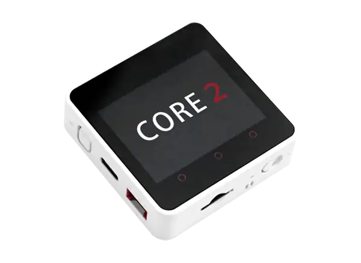
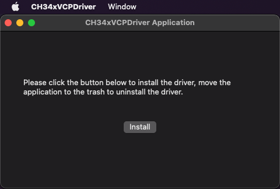
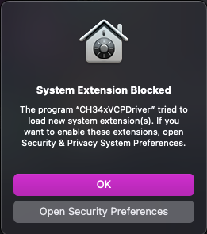
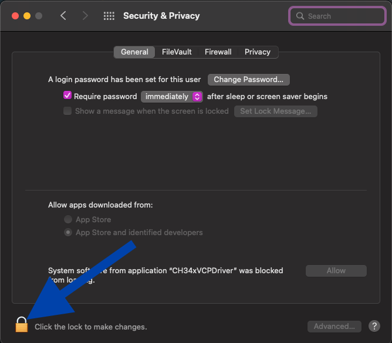
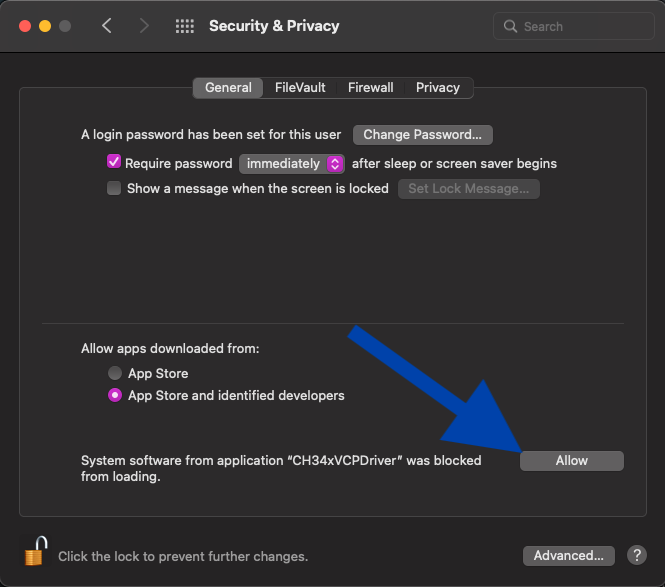

# Bootstrap Zephyr RTOS on M5Stack Core2 from MacOS

This page documents how to install Zephyr toolchain on Mac OS (Monterey / Intel) in order to build and flash Zephyr RTOS demos on a M5Stack Core 2 board.



## Useful links

- Zephyr Getting Started Guide: <https://docs.zephyrproject.org/latest/develop/getting_started/index.html>
- Zephyr M5Stack Core2 board doc: <https://docs.zephyrproject.org/latest/boards/m5stack/m5stack_core2/doc/index.html>
- Zephyr M5Stack Core2 base shield doc: <https://docs.zephyrproject.org/latest/boards/shields/m5stack_core2_ext/doc/index.html>

## Install dependencies

Homebrew

```bash
/bin/bash -c "$(curl -fsSL https://raw.githubusercontent.com/Homebrew/install/HEAD/install.sh)"

(echo; echo 'eval "$(/usr/local/bin/brew shellenv)"') >> ~/.zprofile

source ~/.zprofile
```

Homebrew dependencies

```bash
brew install cmake ninja gperf python3 ccache qemu dtc libmagic wget
```

Python setup

```bash
(echo; echo 'export PATH="'$(brew --prefix)'/opt/python/libexec/bin:$PATH"') >> ~/.zprofile

source ~/.zprofile
```

## Get Zephyr and install Python dependencies

```bash
python3 -m venv ~/zephyrproject/.venv

source ~/zephyrproject/.venv/bin/activate

pip install west

west init ~/zephyrproject
cd ~/zephyrproject
west update

west zephyr-export

pip install -r ~/zephyrproject/zephyr/scripts/requirements.txt
```

Note: run `deactivate` to exit Python's virtual environment whenever you need.

## Instal Zephyr SDK

Check the latest SDK download url on <https://github.com/zephyrproject-rtos/sdk-ng/releases>

```shell
cd ~
curl -L -O https://github.com/zephyrproject-rtos/sdk-ng/releases/download/v0.16.5-1/zephyr-sdk-0.16.5-1_macos-x86_64.tar.xz
curl -L https://github.com/zephyrproject-rtos/sdk-ng/releases/download/v0.16.5-1/sha256.sum | shasum --check --ignore-missing

cd zephyr-sdk-0.16.5-1
./setup.sh
```

Note: You only need to run the setup script once after extracting the Zephyr SDK bundle. You must rerun the setup script if you relocate the Zephyr SDK bundle directory after the initial setup.


## Install Drivers for WCH USB to Serial Chips

**This is not documented on Zephyr website**, but I ran into an issue while flashing the board:

>A fatal error occurred: Failed to write to target RAM (result was 01070000: Operation timed out)
>
>Note: If issues persist, try installing the WCH USB-to-Serial MacOS driver.


This driver can be downloaded from WCH website: <https://www.wch-ic.com/downloads/CH34XSER_MAC_ZIP.html>.

Unzip the downloaded file and run the installer `CH34xVCPDriver.pkg`.

On newest MacOS version, there is an additional step to perform in order to allow the system extension. WCH driver provides an app that facilitates this.

| Screenshot  | Instructions  |
|---|---|
|[](./CH34X_01_Driver_Application_click_Install.png)| This driver application may open automatically following the successful install. If it does not, open LaunchPad, find CH34xVCPDriver Application, and open the App. Click Install to install the driver. |
|[](./CH34X_02_click_open_security_preferences.png)| A security warning may open. If so, click on Open Security Preferences. |
|[](./CH34X_03_sys_prefs_click_lock_to_make_changes.png)| In Security and Privacy, click on the lock icon in the lower-left corner to make changes. |
|[](./CH34X_04_sys_prefs_click_allow.png)| Click Allow to allow the installation to continue. |
|[](./CH34X_05_install_tips_click_ok.png)| Once the installation finishes, you'll see a dialog box open that says "success". Click OK. |

I didn't need to restart my computer after the install (seems to be only needed for OSX 10.15 and below).

## Espressif HAL binaries

Espressif HAL requires WiFi and Bluetooth binary blobs in order work. Run the command below to retrieve those files.

```bash
cd ~/zephyrproject/zephyr
west blobs fetch hal_espressif
```

## Build and flash demos

```bash
cd ~/zephyrproject/zephyr
```

### Hello World

<https://github.com/zephyrproject-rtos/zephyr/blob/main/samples/hello_world/>

Prints Hello World in console. That's it!

```bash
west build --pristine -b m5stack_core2/esp32/procpu samples/hello_world
west flash
west espressif monitor
```

### MPU6050 motion tracking

<https://github.com/zephyrproject-rtos/zephyr/tree/main/samples/sensor/mpu6050>

This sample application periodically (0.5 Hz) measures the sensor temperature, acceleration, and angular velocity, displaying the values on the console along with a timestamp since startup.

```bash
west build --pristine -b m5stack_core2/esp32/procpu samples/sensor/mpu6050 -- -DSHIELD=m5stack_core2_ext
west flash
west espressif monitor
```

### LVGL Graphics (Widgets)

<https://github.com/zephyrproject-rtos/zephyr/blob/main/samples/modules/lvgl/demos/>
and <https://github.com/zephyrproject-rtos/lvgl/blob/zephyr/demos/>

Showcase of LVGL User interface.

```bash
west build --pristine -b m5stack_core2/esp32/procpu samples/modules/lvgl/demos -- -DCONFIG_LV_Z_DEMO_WIDGETS=y
```
